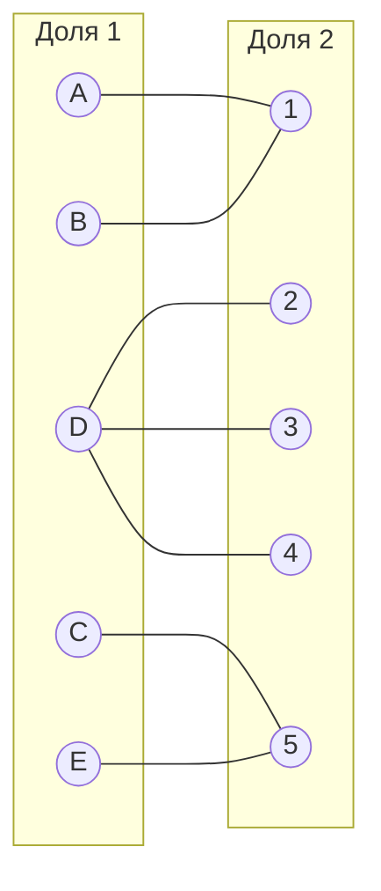
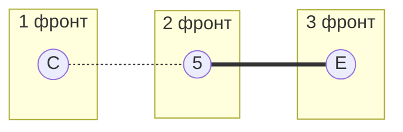

# Решение задачи (Вариант 6)

## Исходная матрица
|   | 1  | 2  | 3  | 4  | 5  |
|---|----|----|----|----|----|
| A | 7  | 11 | 9  | 11 | 14 |
| B | 5  | 13 | 16 | 20 | 17 |
| C | 19 | 10 | 9  | 10 | 7  |
| D | 13 | 5  | 5  | 5  | 18 |
| E | 12 | 20 | 20 | 13 | 7  |

---

## Шаг 1: Вычитание минимального элемента строк
Минимальные элементы строк:  
- A: 7 
- B: 5
- C: 7 
- D: 5
- E: 7 

**Результат:**
|   | 1  | 2  | 3  | 4  | 5  |
|---|----|----|----|----|----|
| A | 0  | 4  | 2  | 4  | 7  |
| B | 0  | 8  | 11 | 15 | 12 |
| C | 12 | 3  | 2  | 3  | 0  |
| D | 8  | 0  | 0  | 0  | 13 |
| E | 5  | 13 | 13 | 6  | 0  |

