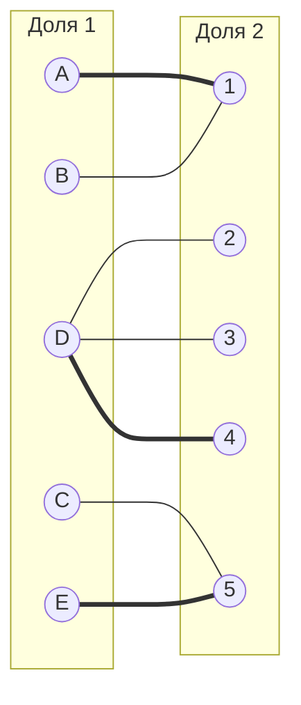
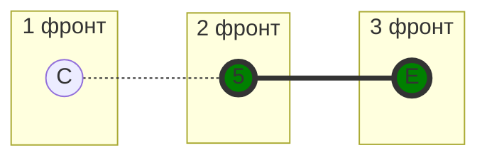
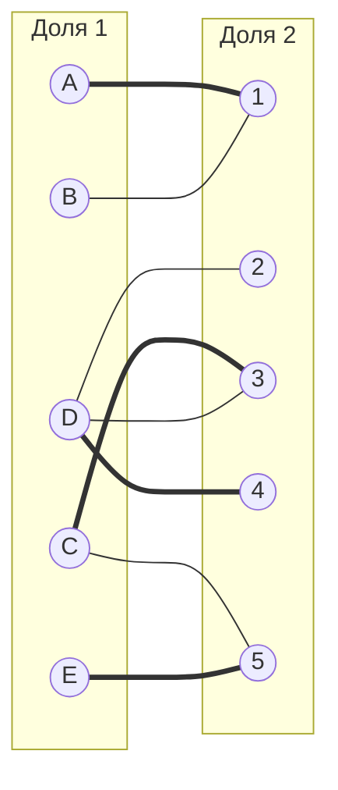
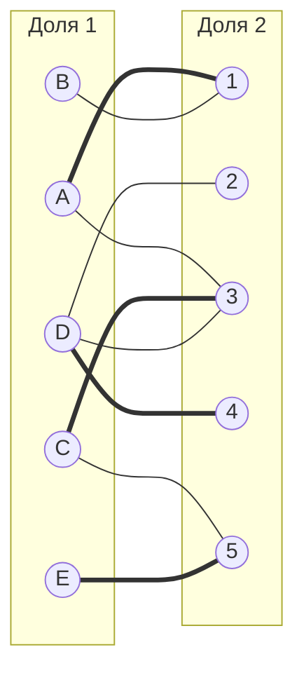
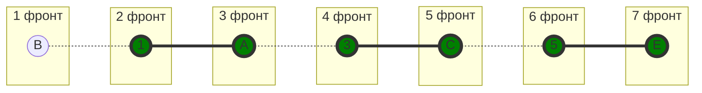

# Решение задачи (Вариант 6)

## Исходная матрица
|   | 1  | 2  | 3  | 4  | 5  |
|---|----|----|----|----|----|
| A | 7  | 11 | 9  | 11 | 14 |
| B | 5  | 13 | 16 | 20 | 17 |
| C | 19 | 10 | 9  | 10 | 7  |
| D | 13 | 5  | 5  | 5  | 18 |
| E | 12 | 20 | 20 | 13 | 7  |

---

## Шаг 1: Вычитание минимального элемента строк
Минимальные элементы строк:  
- A: 7 
- B: 5
- C: 7 
- D: 5
- E: 7 

**Результат:**
|   | 1  | 2  | 3  | 4  | 5  |
|---|----|----|----|----|----|
| A | 0  | 4  | 2  | 4  | 7  |
| B | 0  | 8  | 11 | 15 | 12 |
| C | 12 | 3  | 2  | 3  | 0  |
| D | 8  | 0  | 0  | 0  | 13 |
| E | 5  | 13 | 13 | 6  | 0  |

X = {C,E}
Y = {5}

Переместим строки C, E и столбец 5

|   | 5  | 1  | 2  | 3  | 4  |
|---|----|----|----|----|----|
| C | 0  | 12 | 3  | 2  | 3  |
| E | 0  | 5  | 13 | 13 | 6  |
| A | 7  | 0  | 4  | 2  | 4  |
| B | 12 | 0  | 8  | 11 | 15 |
| D | 13 | 8  | 0  | 0  | 0  |

Минимум = 2
Вычитаем из строк C E 2 и прибаляем к столбцу 5 +2, чтобы избежать отрицательных чисел

|   | 5  | 1  | 2  | 3  | 4  |
|---|----|----|----|----|----|
| C | 0  | 12 | 3  | 2  | 3  |
| E | 0  | 5  | 13 | 13 | 6  |
| A | 7  | 0  | 4  | 2  | 4  |
| B | 12 | 0  | 8  | 11 | 15 |
| D | 13 | 8  | 0  | 0  | 0  |

Получаем:
|   | 1  | 2  | 3  | 4  | 5  |
|---|----|----|----|----|----|
| A | 0  | 4  | 2  | 4  | 9  |
| B | 0  | 8  | 11 | 15 | 14 |
| C | 10 | 1  | 0  | 1  | 0  |
| D | 8  | 0  | 0  | 0  | 15 |
| E | 3  | 11 | 11 | 4  | 0  |

Получаем новое ребро C - 3, которое сразу отмечаем как закрашенное (увеличиваем паросочетание)), так как вершины C и 3 незакрашенные.
 

При помощи волнового метода ищем чередующиеся цепи

Чередующиеся цепи не найдены => текущее паросочетание максимально, но не совершенно, поэтому добавляем новые ребра
X = {A,B}
Y = {1}

|   | 1  | 2  | 3  | 4  | 5  |
|---|----|----|----|----|----|
| A | 0  | 4  | 2  | 4  | 9  |
| B | 0  | 8  | 11 | 15 | 14 |
| C | 10 | 1  | 0  | 1  | 0  |
| D | 8  | 0  | 0  | 0  | 15 |
| E | 3  | 11 | 11 | 4  | 0  |

Минимум = 2
Вычитаем из строк A B 2 и прибаляем к столбцу 1 +2, чтобы избежать отрицательных чисел

Получаем:
|   | 1  | 2  | 3  | 4  | 5  |
|---|----|----|----|----|----|
| A | 0  | 2  | 0  | 2  | 7  |
| B | 0  | 6  | 9  | 13 | 12 |
| C | 12 | 1  | 0  | 1  | 0  |
| D | 10 | 0  | 0  | 0  | 15 |
| E | 5  | 11 | 11 | 4  | 0  |

Получили новое ребро A - 3, которое не берем в паросочетание, так как вершины А и 3 - закрашенные

При помощи волнового метода ищем чередующиеся цепи

Чередующиеся цепи не найдены => текущее паросочетание максимально, но не совершенно, поэтому добавляем новые ребра

X = {A,B,C,E}
Y = {1,3,5}

Получаем:
|   | 1  | 3  | 5  | 2  | 4  |
|---|----|----|----|----|----|
| A | 0  | 0  | 7  | 2  | 2  |
| B | 0  | 9  | 12 | 6  | 13 |
| C | 12 | 0  | 0  | 1  | 1  |
| E | 5  | 11 | 0  | 11 | 4  |
| D | 10 | 0  | 15 | 0  | 0  |

Минимум = 1
Из строчек A,B,C,E вычитаем 1, а к столбцам 1,3,5 прибавляем 1

Получаем:
|   | 1  | 2  | 3  | 4  | 5  |
|---|----|----|----|----|----|
| A | 0  | 1  | 0  | 1  | 7  |
| B | 0  | 5  | 9  | 12 | 12 |
| C | 12 | 0  | 0  | 0  | 0  |
| D | 11 | 0  | 1  | 0  | 16 |
| E | 5  | 0  | 11 | 0  | 0  |

Получили новые ребра -  C -2, C - 4, которые не закрашиваем, так как эти вершины уже закрашены
А также ребро D -3 было утеряно
